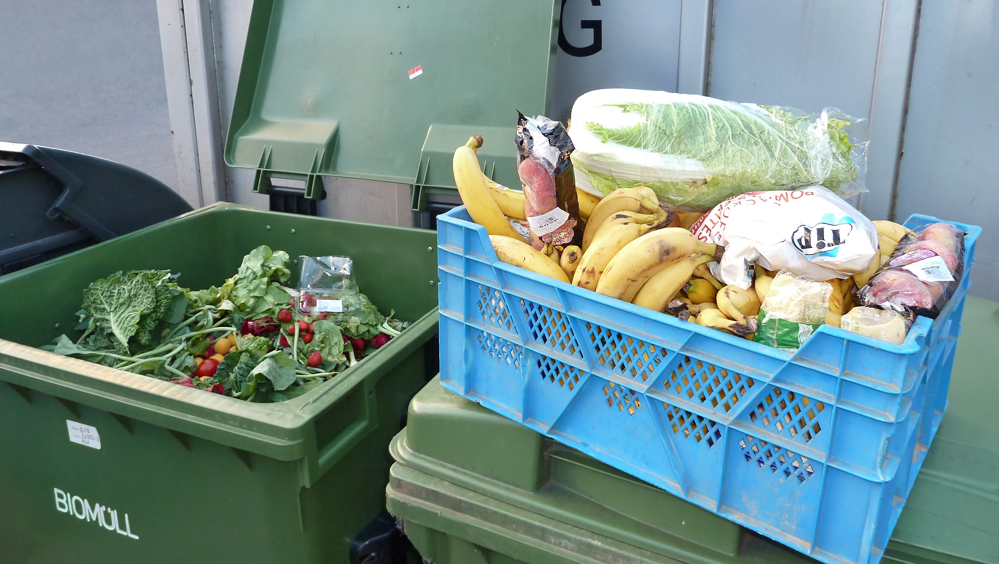
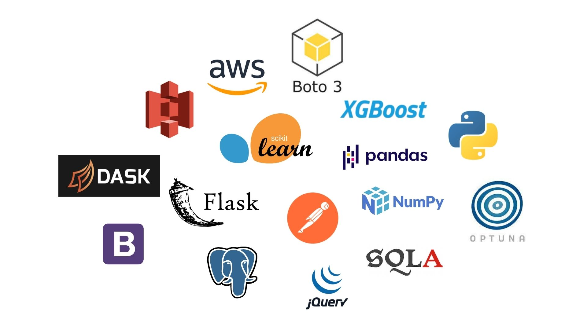
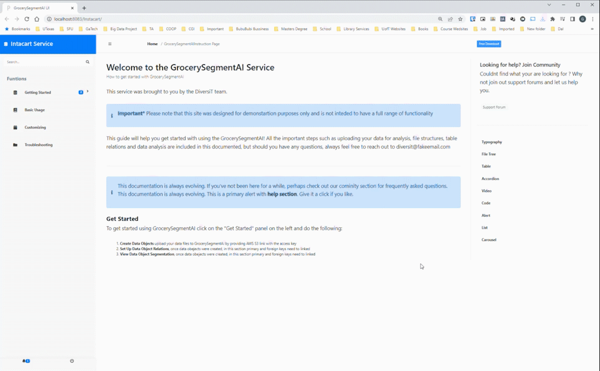
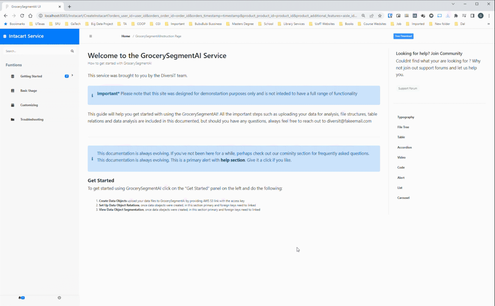
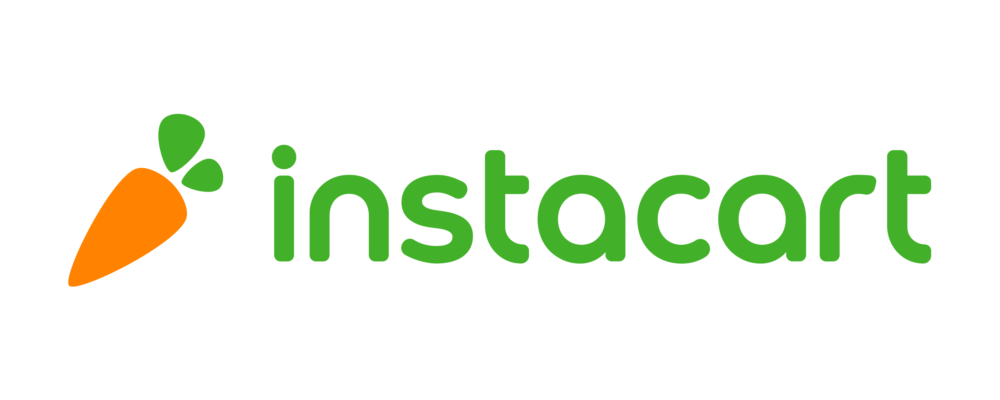
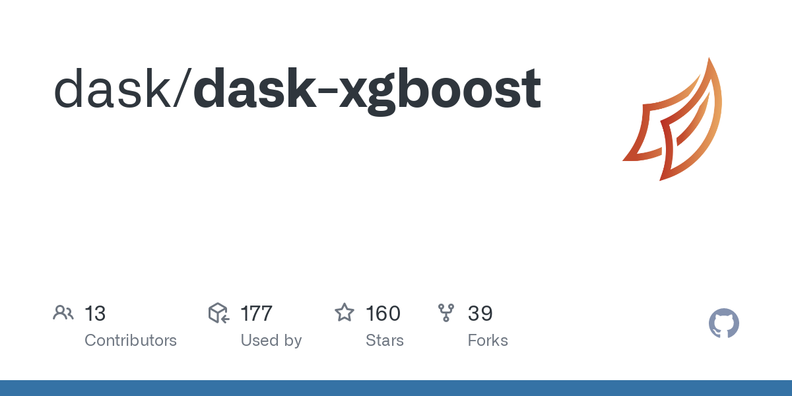
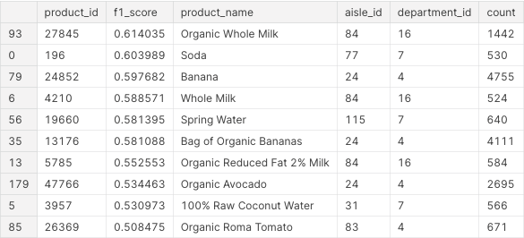
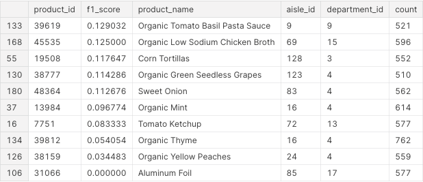

# GrocerySegmentAI

GrocerySegmentAI is a PAAS for grocery businesses. It provides a means for companies to upload customer data and receive predictions on the products that each of their customers will order next. 

For more information please refer to the following [blog post](https://medium.com/@BrendanArtley/grocerysegmentai-the-convergence-of-artificial-intelligence-and-market-segmentation-eee5b47c15fc). 

## What problem does this solve?

Every grocery business is driven by its customers. For it to be successful, it must know what its customers want now, and what they want in the future. This allows them to optimize marketing strategies, improve customer experience, and maximize customer value.

Additionally, 30% of food in North-American grocery stores is thrown away. By predicting which products will be bought next, we are providing a means of improving inventory management and reducing food waste with machine learning.

## Solution

GrocerySegmentAI. This product is an end-end solution that is easy to use and requires little technical expertise. You can simply upload customer data into an S3 bucket on AWS, wait for a model to train, and that's it! You can then enter a product_id, and you are given a list of customers who are likely to buy that product on their next order. 

## Technologies

This product was built with many technologies and packages. In the following image, we show the main ones used.

## User Interface

The interface was created with ease of use being a priority. In the first GIF, we can see a user enter their S3 bucket information to initiate model training. During training, the user can get status updates via the interface. The training time depends on the size of the input data.

In the second GIF, model training is complete, and the user is now selecting a product id. When they submit this form, they receive a CSV file containing all of the customers that will buy the selected product on their next order.

## Dataset

Due to privacy concerns, there are a very small number of comprehensive customer datasets available in the public domain. That being said, we were able to build this product using the [Instacart Dataset](https://www.kaggle.com/c/instacart-market-basket-analysis). This dataset is anonymized and contains a sample of over 3 million grocery orders from more than 200,000 Instacart users.

We simplified this dataset by combining features whilst losing zero information. We did this to reduce the number of required columns for the product. This modified version of the dataset can be found [here](https://www.kaggle.com/datasets/brendanartley/simplifiedinstacartdata).

## Model

Our best model was an XGBoost Classifier that achieved an F1 score of 0.39. We used F1-score rather than raw accuracy as about 90% of the predicted labels were 0. This metric gave us a more realistic measure of performance. We also used a subset of the data and a framework called Optuna to find the best hyperparameters for this model.

Other models that we tested included Logistic Regression, Tabnet, LGBM, and K-means clustering.

## Performance

Using cross-validation we were able to get predictions on every user in the dataset. This gave us an evaluation of model performance in the real world.

After analyzing predictions, we found that the model was able to accurately predict some products, and others not so much. In this first image, we see the products which the model performed well on, and in the second image, we have those where the model did not. The numerical column is the f1-score of each product. 

  

## Improvements

The first thing we would have liked to improve on is the product evaluation. Given the privacy concerns we touched on above, there are very few customer datasets in the public domain. Unfortunately for us, this meant that we were only able to test our model on data from one grocery business. Moreover, we would also like to test our product in other industries with frequent purchase activities, such as restaurants and retail stores. 

Second, we would also want to explore RNN and LSTM-based models as they typically perform well on time series data. Given that our orders are in a sequential format, it would be interesting to see if we could incorporate these models into the pipeline.

## Installation

We have provided a comprehensive guide below to explain this setup process.

Required Software/Packages
- Make sure that you have and up to date Java JDK installed (>12.0.2)
- Download and install MySQL server, MySQL Workbench, JRE, and Eclipse EE Edition
- Run `pip3 install -r requirements.txt` from the repo to install python packages

Import the project
- Open Eclipse
- Select File -> Open Projects
- Click on Directory
- Navigate to this repo and select UI/code/Instacart directory
- Click on Select Folder
- Once the project is selected in the Project Description box click Next

Create the Server
- In Eclipse press File -> New -> Other
- Click on Server dropdown and select Server
- Click on Next
- Click on Apache dropdown, scroll down and select Tomcat v9.0 Server
- Click on Next
- In the Available box you should see Instacart(Instacart-0.0.1-SNAPSHOT)
- Select it and click on Add
- Click Next
- Click Finish

Configure Project
- In the project explorer window right-click on the Instacart project
- Click on Build Path -> Configure Build Path
- In the libraries tab select JRE System Libraries
- Click on Edit
- Select Alternate JRE radio and select your JRE version
- Click on Finish
- In the Java Build Path Menu click on Add External JARs
- Navigate to UI/server/apache-tomcat-9.0.54/lib and select servlet-api.jar
- Click on open
- Then in the Build Path Menu click on Apply and Close

Configure MySQL Database
- Open MySQL Workbench
- Select the connection to your MySQL server
- Click on the Administration tab
- Click on Data Import/Restore
- Select Import from Self-Contained File radio
- Click on the 3 dots button to locate the file
- Navigate to our repo to the UI/db_backup/
- Select GrocerySegmentAI.sql file
- Click open
- Click Start Import
- In the MySQL Workbench in the Navigator window click on the Schemas tab
- Right-click on the empty space in the SCHEMAS window and click on Refresh ALL

Launch the UI
- In the Eclipse right-click on the Instacart project
- Click on Run As -> Run on Server
- Click on the localhost dropdown
- Select Tomcat v9.0
- Click on Next
- Click on Finish

Launch API
- Navigate to the backend/ folder
- Run `python3 segmentation_service.py`
